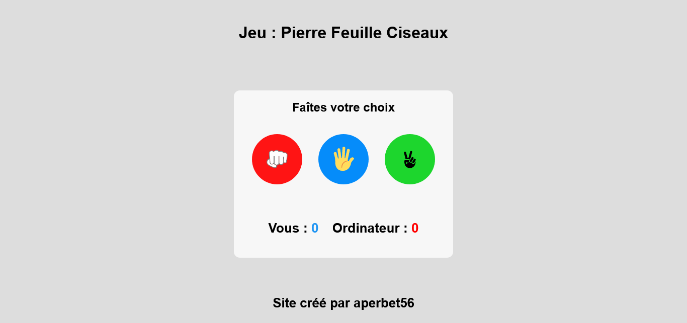

## JEU : PIERRE FEUILLE CISEAUX ✂️👊

## Le challenge

Mon but a été de réaliser une adaptation du célèbre jeu Pierre, Feuille, Ciseaux.
L'utilisateur va affronter ici l'ordinateur.
Pour jouer :

- l'utilisateur va devoir choisir entre la pierre, la feuille et le ciseaux et donc cliquer sur le bouton correspondant.

- l'ordinateur va lui aussi faire un choix entre la pierre, la feuille et le ciseaux ( choix géré dynamiquement en JavaScript)

- si l'utilisateur choisit la pierre et l'ordinateur le ciseaux, ou si l'internaute choisit la feuille et l'ordinateur la pierre ou si l'utilisateur choisit le ciseaux et l'ordinateur la feuille, c'est l'utilisateur qui gagne.
  Dans les cas contraires, c'est l'ordinateur qui remporte la manche.

- un petit texte indique qui est le gagnant ainsi que les choix effectués par l'internaute et l'ordinateur.

- les scores se mettent à jour en fonction du gagnant.

- Page web responsive

## Démonstration

lien vers le projet : https://aperbet56.github.io/rock_paper_scissors_game/

## Développez avec

- Utilisation des balises sémantiques HTML5
- CSS
- Flexbox
- Animation CSS au survol de la souris sur le container et les boutons
- JavaScript
- Desktop first
- Page web responsive
